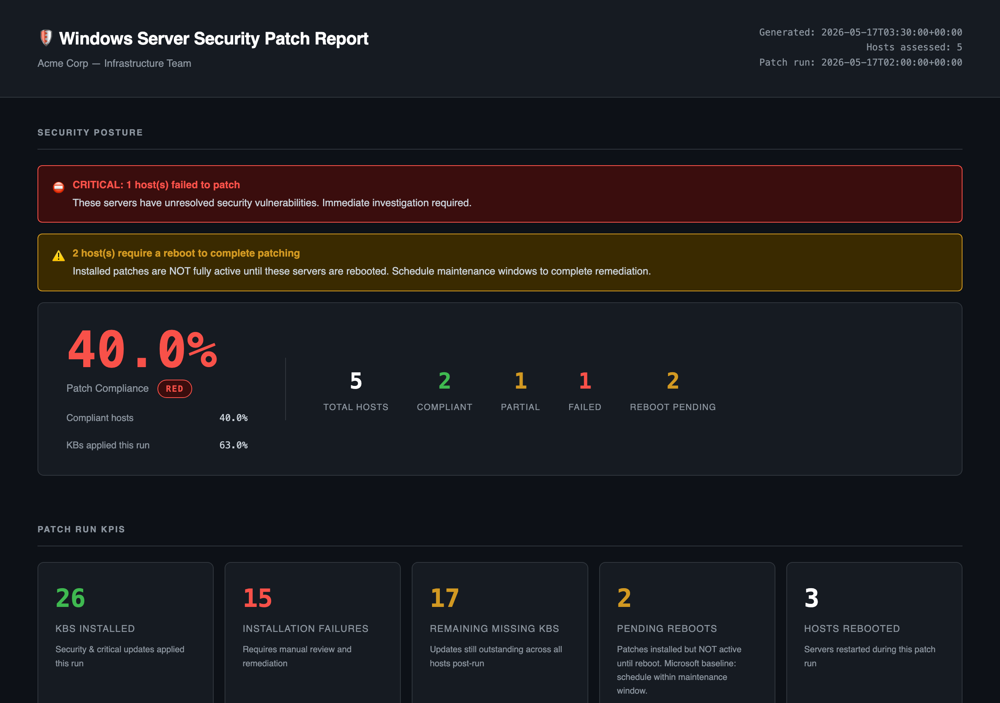

# Windows Server Patching & Posture Reporting via AAP

Automate Windows Server patching from **Ansible Automation Platform (AAP)** and produce a security-posture report that tells Windows administrators exactly where their fleet stands.

> Built for **AAP 2.7**, not ansible-core. Uses **certified** Red Hat content (`ansible.windows`, `ansible.controller`). Credentials live in AAP custom credential types — **no vaulted files** in git. The inventory is supplied by your platform (an AWS-backed one by default) — this repo does not ship one for AAP.

**[See an example report →](https://mlowcher61.github.io/windows_updates/example_report.html)**

[](https://mlowcher61.github.io/windows_updates/example_report.html)

---

## What this solves

Windows Update for Business reports (Microsoft's hosted reporting service) **only supports Windows 10/11 clients** — it does **not** cover Windows Server. Server admins are typically left stitching together WSUS reports, SCCM compliance views, or Azure Update Manager (Arc-only) to answer a simple question: *"What is the patch posture of my Windows Server fleet right now?"*

This repository delivers, end-to-end:

1. A scheduled, change-controlled **patch workflow** in AAP (scan → approval → install → reboot → verify)
2. A single **security-posture report** (HTML + CSV + email) that summarises the fleet against a weighted scoring model derived from Microsoft Learn guidance on patch compliance and the ASD Essential Eight ISM controls 1694 / 1877

## Architecture (at a glance)

```
┌──────────────────────────────────────────────────────────────────────────┐
│                        AAP Workflow Template                              │
│                                                                          │
│  ┌─────────┐    ┌──────────┐    ┌─────────┐    ┌─────────┐    ┌────────┐ │
│  │  Scan   │──▶ │ Approval │──▶ │ Install │──▶ │ Verify  │──▶ │ Report │ │
│  │   JT    │    │  (prod)  │    │   JT    │    │ (in JT) │    │   JT   │ │
│  └─────────┘    └──────────┘    └─────────┘    └─────────┘    └────────┘ │
│       │                              │              │              │     │
│       ▼                              ▼              ▼              ▼     │
│  $AWX_PRIVATE_DATA_DIR/patch_facts/<host>.{scan,install}.json           │
│                                                          │              │
│                                                          ▼              │
│                                                  HTML + CSV artifact    │
│                                                  + email to admins      │
│                                                          │              │
└──────────────────────────────────────────────────────────┼──────────────┘
                                                           ▼
                                              ┌────────────────────────┐
                                              │  Report web host       │
                                              │  nginx :8888           │
                                              │  /var/www/patch-reports│
                                              └────────────────────────┘
```

## Prerequisites

| Component | Minimum | Notes |
| --- | --- | --- |
| Ansible Automation Platform | 2.7 | Config-as-code uses the certified `ansible.controller` collection. `ansible.platform` covers only gateway/identity objects, so job templates and credentials stay on `ansible.controller` |
| Inventory | Provided by you in AAP | Attached to every job template by name — `AWS Inventory` by default. Not shipped in this repo |
| Target Windows Server | 2016 / 2019 / 2022 / 2025 | 2012 R2 still works (ESU only — flagged in report) |
| WinRM | Listener on 5986 (HTTPS) | Kerberos preferred; NTLM supported |
| Execution Environment | Custom EE in `execution-environment/` | Includes `pywinrm`, `requests-kerberos`, `jmespath` |
| Report web host (optional) | Any RHEL-family Linux host | Serves reports over nginx on 8888; reachable by SSH with sudo. Omit it and reports are email-only |

## Quick start (demo — single host)

```bash
# 1. Install dependencies
ansible-galaxy collection install -r collections/requirements.yml

# 2. Edit the demo inventory with your test host
vi inventories/demo/hosts.yml

# 3. Run the full cycle. The demo inventory already sets ansible_user, so only
#    the password is needed (demo only — production uses AAP credentials)
ansible-playbook -i inventories/demo/hosts.yml playbooks/99_full_cycle.yml \
  -e ansible_password='...'

# 4. Open the report
open reports/posture-report-*.html
```

## Production setup

### 1. Deploy AAP config-as-code

Run this from a job template in AAP with a **Red Hat Ansible Automation
Platform** credential attached. That credential injects `CONTROLLER_HOST`,
`CONTROLLER_USERNAME` and `CONTROLLER_PASSWORD` into the job environment, and
the `ansible.controller` modules read them automatically — so no hostname or
password is ever passed as an extra-var or stored in git.

To run it from a workstation instead, export the same variables yourself:

```bash
export CONTROLLER_HOST=aap.example.com
export CONTROLLER_USERNAME=admin
export CONTROLLER_PASSWORD=...        # or CONTROLLER_OAUTH_TOKEN
ansible-navigator run aap/deploy_aap.yml
```

This creates:
- 3 **custom credential types** (`windows_winrm_kerberos`, `wsus_source`, `smtp_relay`)
- 4 **empty credentials** of those types, ready for you to fill in (see below)
- 3 **job templates** (Scan, Install, Report)
- 1 **workflow template** with a conditional approval node
- 2 **notification templates** (success / failure email)
- 2 **schedules** (third Friday for dev, Patch Tuesday + 7 days for prod)

### 2. Enter credentials in AAP

After `deploy_aap.yml` runs, open AAP → Resources → Credentials. Five credentials need values filled in:
- `cred_winrm_prod` — Windows service account for prod hosts
- `cred_winrm_dev` — Windows service account for dev hosts
- `cred_wsus_corporate` (optional) — see note below
- `cred_smtp_relay` — relay used for the report email
- `cred_report_host_ssh` — SSH key for the report web host; needs sudo there

> **Note on `cred_wsus_corporate`.** The `wsus_source` credential type injects
> `wsus_server_url` and `wsus_proxy` as extra vars, but **no role currently reads
> them** — `ansible.windows.win_updates` has no URL parameter, so pointing hosts
> at WSUS means writing the `WUServer` policy registry keys and setting
> `server_selection: managed_server`. Until that is wired up the field is inert:
> leave it empty, or put a plausible value such as `http://wsus.example.com:8530`
> (8530 is the WSUS HTTP default, 8531 HTTPS) if you want it populated for a
> demo. Nothing will attempt to reach it.

### 3. Attach your inventory

The job templates do **not** create an inventory. They attach one that already
exists in AAP, by name — `AWS Inventory` by default. To point them at a
differently-named inventory, set it once at deploy time:

```bash
ansible-playbook aap/deploy_aap.yml -e aap_inventory_name="My Inventory"
```

Inside that inventory, create the groups the playbooks target:

| Group | Behaviour |
| --- | --- |
| `prod` | Approval gate enforced, install Security + Critical only |
| `dev` | No approval, install all update categories |
| `sensitive` | Scan-only — never installs, only reports |
| `report_hosts` | Linux host that serves the posture report site (see step 4) |

With a dynamic AWS source, populate these with a `keyed_groups` / constructed
rule on an EC2 tag rather than by hand, so the groups survive instance
replacement.

> **`inventories/` is for local `ansible-playbook` runs only.** AAP never reads
> it — the platform writes each job's inventory to `/runner/inventory/`, and
> Ansible only auto-loads `group_vars/` adjacent to the inventory source or the
> playbook. Under AAP, per-run settings come from the job template surveys.

### 4. Set up the report web host

The rendered HTML only exists inside the execution environment's container,
which AAP destroys when the job ends. To keep reports around, the Report job
publishes them to a Linux host running nginx.

Put that host in the `report_hosts` group inside **AWS Inventory** (keep it out
of `windows_servers` so it never lands in a patch play's host pattern), then
launch **`Windows Patch — Set Up Report Host`** once, answering its **Report web
host** survey question. It installs nginx, creates `/var/www/patch-reports`,
labels the port for SELinux, opens firewalld if it is running, and serves the
docroot on **port 8888**. The job is idempotent, so re-running it just
reconciles drift.

| Setting | Default | Where |
| --- | --- | --- |
| Listen port | `8888` | Survey on the Set Up Report Host template |
| Docroot | `/var/www/patch-reports` | `report_site_root` |
| Which host serves reports | `report_hosts` group in AWS Inventory | `report_web_host` survey on **both** report templates |
| Report host SSH port | `22` | `report_host_ssh_port` extra var |
| Report runs kept | `4` | `report_site_retention_count` survey on the Report template |

**Choosing the server.** `report_web_host` takes either a host name or a group
name from the attached inventory, and both report templates ask for it — set
them to the same value. Leave it at `report_hosts` to publish to every member of
that group, or name a single host to pin one box:

```bash
ansible-playbook -i inventories/production/hosts.yml playbooks/03_report.yml \
  -e report_web_host=report-web-01
```

It must arrive as an extra var — the publish play templates it into its `hosts:`
line at parse time, and AAP's own inventory does not read `group_vars` from this
repo, so a `group_vars` entry would work locally and silently do nothing in AAP.

Because the report host is Linux while the rest of the inventory is Windows,
both report playbooks pin `ansible_connection: ssh` (and port 22) in their play
vars. Play vars outrank inventory vars, so this holds even when AWS Inventory
carries winrm defaults on `all`. `ansible_user` is deliberately *not* pinned —
it comes from the `cred_report_host_ssh` Machine credential.

**Reading the reports.** Two URLs:

- `http://<report host>:8888/latest.html` — the most recent run, stable link
- `http://<report host>:8888/` — the archive; filenames carry a UTC stamp, so
  the directory listing *is* the run history

Older runs are pruned to the newest `report_site_retention_count` (4) of each
file type, so the listing stays readable. Set it to `0` to keep everything.
`latest.html` is never pruned.

Publication is **best-effort**: the email has already gone out by the time it
runs, so an unreachable web host logs a warning and the job still succeeds
rather than turning your patching workflow red.

### 5. First run

Launch the workflow template `Windows Patch Cycle` from AAP. The Scan node runs
first; when it finishes the workflow pauses at the approval node until a human
approves or denies.

**What the approver sees.** The Scan node ends with a `FLEET SCAN SUMMARY`
block — hosts scanned, how many responded, how many are eligible, and the total
missing updates split by Security and Critical — followed by a per-host
breakdown and an explicit recommendation:

| Recommendation | Meaning |
| --- | --- |
| `APPROVE` | Every host responded, none pending reboot, updates are ready |
| `HOLD` | Some hosts need attention; approving still patches the healthy subset |
| `DENY` | No updates found anywhere — deny to skip install and go to the report |

**Eligibility policy.** A host is patched only if it responded to the scan *and*
was not already pending a reboot beforehand. Unreachable and already-pending-reboot
hosts are listed under `EXCLUDED FROM INSTALL` and skipped, so one dead host
never blocks the rest of the fleet. The Scan job publishes the eligible list as
the `patch_eligible_hosts` workflow artifact, which `02_install.yml` consumes as
its host pattern. If nothing is eligible, the install targets **no** hosts rather
than falling back to the whole group.

If approval is denied — or if the scan or install fails — the workflow routes
straight to the Report node, so every run produces a report either way. The
report appears as a job artifact and is emailed to the distribution list.

Running `playbooks/02_install.yml` outside the workflow has no artifact to read,
so it falls back to targeting the whole `target_group`.

## Reading the report

A live example is published here: **[mlowcher61.github.io/windows_updates/example_report.html](https://mlowcher61.github.io/windows_updates/example_report.html)**

The HTML report has four sections:

1. **Fleet grade card** — A–F grade with overall score out of 100
2. **Posture breakdown** — six metrics as progress bars (security currency, ISM SLA compliance, reboot hygiene, OS lifecycle, recency, failure rate)
3. **Top 5 risks** — the most urgent hosts, each with a plain-English reason.
   The default ranking is a straight sort by posture score, worst grade first.
   That is a deliberate placeholder: ranking strategy is the one part of the
   scoring model that depends on how your team triages (lifecycle-first for
   audit-driven shops, severity-weighted for CVE response, and so on). See
   [docs/REPORT_METRICS.md](docs/REPORT_METRICS.md#top-risks-ranking) for the
   options and `filter_plugins/posture.py :: top_risks_ranking()` to change it.
4. **Per-host detail** — collapsible blocks with missing KBs, lifecycle status, errors

See [docs/REPORT_METRICS.md](docs/REPORT_METRICS.md) for the exact scoring formula and Microsoft Learn references.

## Customization

| Want to change… | Edit this file |
| --- | --- |
| Posture grade weights | `roles/windows_patch_report/defaults/main.yml` |
| ISM compliance thresholds (48hr / 14d) | `roles/windows_patch_report/defaults/main.yml` |
| Update categories per environment | `inventories/production/group_vars/<group>.yml` (local runs) / `install_categories` |
| Update categories for a single run | **Override categories** multiselect on the Install job template |
| OS lifecycle dates | `files/os_lifecycle.yml` |
| Install batch size (serial %) | `inventories/production/group_vars/<group>.yml` |
| Report email recipients | Survey on the Report job template in AAP |
| Top Risks ranking strategy | `filter_plugins/posture.py :: top_risks_ranking()` |
| Number of hosts in Top Risks | `top_risks_count` in `roles/windows_patch_report/defaults/main.yml` |

### Overriding update categories for one run

The Install job template's **Override categories** question is a multiselect.
Leave everything unselected and the run uses `install_categories` as resolved
from the role default (`SecurityUpdates` + `CriticalUpdates`) or the inventory
group. Select anything and it **replaces** that list for the run — it does not
add to it. The job logs which of the two it used before installing anything.

The choices are fixed rather than free text for a reason: `win_updates` passes
an unrecognised category name through verbatim, matches no update, and then
reports success having installed nothing. Only these names resolve —

| Mapped from camelCase | Matched as-is |
| --- | --- |
| `SecurityUpdates`, `CriticalUpdates`, `UpdateRollups`, `DefinitionUpdates`, `DeveloperKits`, `FeaturePacks`, `ServicePacks` | `Updates`, `Upgrades`, `Application`, `Connectors`, `Guidance`, `Tools` |

The left column is converted to the spaced strings Windows Update actually
reports (`SecurityUpdates` → `Security Updates`) by the module's PowerShell
side; the right column needs no conversion. This is also why the scan summary
in `playbooks/01_scan.yml` filters on `'Security Updates'` **with** a space
while the category inputs have none.

On the CLI the same variable accepts a list or a comma-separated string:

```bash
ansible-playbook playbooks/02_install.yml -e install_categories_override=Updates,Upgrades
```

## Extending

- **ServiceNow integration** — push report records into CMDB / change tickets. See [docs/EXTENDING.md](docs/EXTENDING.md).
- **Promotion to a collection** — `galaxy.yml` already in place. See [docs/EXTENDING.md](docs/EXTENDING.md).
- **Molecule tests** — not yet implemented; on the roadmap.

## Troubleshooting

| Symptom | Likely cause | Fix |
| --- | --- | --- |
| WinRM connection fails | Kerberos ticket / SPN missing | Verify `setspn -L <service-account>` includes HTTP/host |
| `win_updates` hangs | Windows Update service paused | `Get-Service wuauserv` on host; restart if Stopped |
| `No patch facts available to report on` / Report shows 0 hosts | Under a workflow, the Report job runs in its own container with its own `AWX_PRIVATE_DATA_DIR`, so the `.scan.json` / `.install.json` files written by earlier job templates are already destroyed. Facts must travel as workflow artifacts, not on disk | Confirm the Scan node's `Publish eligible host list to downstream workflow nodes` task ran, and that the Report job template has `ask_variables_on_launch: true` so artifacts are accepted. `patch_facts_dir` is only used for standalone runs of `99_full_cycle.yml`, where all three plays share one control node |
| ISM SLA always failing | First run has no history | Posture computes from current scan only — accurate after 2+ cycles |
| All workflow nodes launch simultaneously | Node edges declared at the top level of a `workflow_nodes` entry instead of under `related:` — the module silently ignores them, leaving every node parentless, and AAP launches all parentless nodes at once | In `aap/05_workflow_template.yml`, nest `success_nodes` / `failure_nodes` under `related:` and write targets as `- identifier: <name>` dicts, not bare strings |
| `Failed to associate item {'Error': 'Relationship not allowed.'}` when deploying the workflow | The same child listed under both `success_nodes` and `failure_nodes` of one parent. A parent→child pair may carry only one edge type, and the module submits both associations together | Use `always_nodes` for a child that should run regardless of the parent's outcome. It is mutually exclusive with `success_nodes`/`failure_nodes` on that same parent |
| Deleted a node from the CaC file but it still runs | `destroy_current_nodes` defaults to `false`, so removing an entry orphans the node in AAP rather than deleting it | Keep the entry and add `state: absent` (see the `node_report_after_failure` tombstone), or set `destroy_current_nodes: true` to rebuild the graph from scratch on every deploy |
| Report node never runs | `all_parents_must_converge: true` on a node whose parents are mutually exclusive paths | Leave it `false` — the report has three possible parents (scan-fail, approval-deny, install) and only one path fires per run |
| Install patched hosts you expected to be skipped | `patch_eligible_hosts` artifact not reaching the Install node | Confirm the Scan job's `set_stats` task ran and that the Install job template has `ask_variables_on_launch: true` |
| Approval gate appears on every run, including dev | Expected — the approval node is unconditional. `require_approval` is set in group_vars but nothing reads it | See the note in [Known gaps](#known-gaps) |

## Known gaps

**`require_approval` is inert.** The variable is set in
`inventories/production/group_vars/` (`prod: true`, `dev`/`sensitive`/`windows_servers: false`)
and in `aap/07_schedules.yml`, but no playbook, role, or workflow node reads it.
The approval node in `Windows Patch Cycle` is unconditional, so **every** run
pauses for approval regardless of target group — including dev and scheduled
runs. The table in [Environment behaviour](#3-inventory-groups) describing dev as
"no approval" is aspirational, not current behaviour.

AAP workflow approval nodes cannot be bypassed by an extra_var, so closing this
gap means either accepting a single gate for all environments, or splitting into
separate per-environment workflow templates.

## License

MIT. See `LICENSE`.

## Maintainer

Mark Lowcher · mlowcher@redhat.com · https://github.com/mlowcher61
